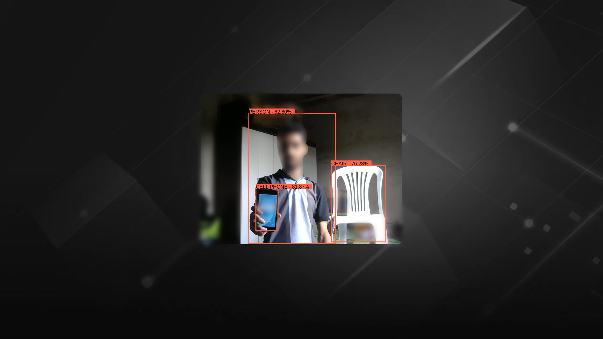

<p align="center">
  
</p>

## Description

This application detects objects using TensorFlow.js, the CocoSSD model is already trained, it has 80 different classes for detection, such as Person, Cat, Dog, Cell Phone, Chair, etc.

To run this application it is necessary to have a WebCam to capture the video, the detection process is in real time, and to display the geometric shape the HTML Canvas was used.

## Install dependencies

```bash
$ npm install
```

If you have any errors in the installation process, run the command below:

```bash
$ npm install --legacy-peer-deps
```

## Running the app

```bash
# Development mode
$ npm run dev

# Production mode
$ npm run build
$ npm run preview
```

### Now access app:

- **Development mode**: http://localhost:3000
- **Production mode**: http://localhost:4173

## License

[MIT License](LICENSE).
